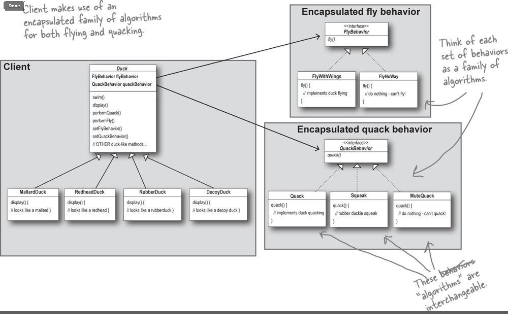

## Introduction
*The best way to retain design patterns is to memorize, understand how they work and finally identify places where they are applicable while designing applications.*

*CHANGE is the One Constant in Software Development.*

# Design Patterns
# 1. Strategy Pattern
Strategy lets the algorithm vary independently from clients that use it.

### Design Principles

#### Identify the aspects of your application that vary and seperate them from what stays the same
- Take the parts that vary and encapsulate them, so that later you can alter or extend the parts that vary without affecting those that don’t.

#### Program to interface and not the implmentation
- Depending only the interface allows for loose coupling of inter dependent classes
- It prevents a class from getting locked with a concrete implementation, instead it will be relying on an interface

#### Favor composition over inheritance
- There are three types of relationships between classes: *IS-A* (inheritance), *HAS-A* (composition), *Implements*
- Using compostion allows for more flexibilty by encapsulating a family of algorithms into logical classes

*“Knowing basic OO concepts doesn't automatically make you a good OO designer” *
# 2. Observer Pattern 